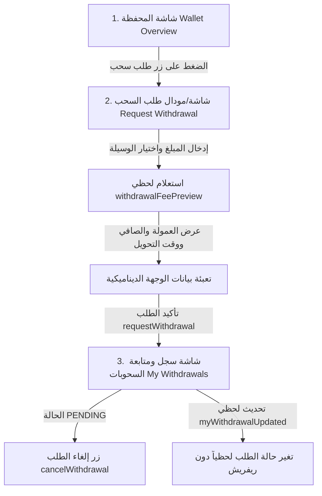
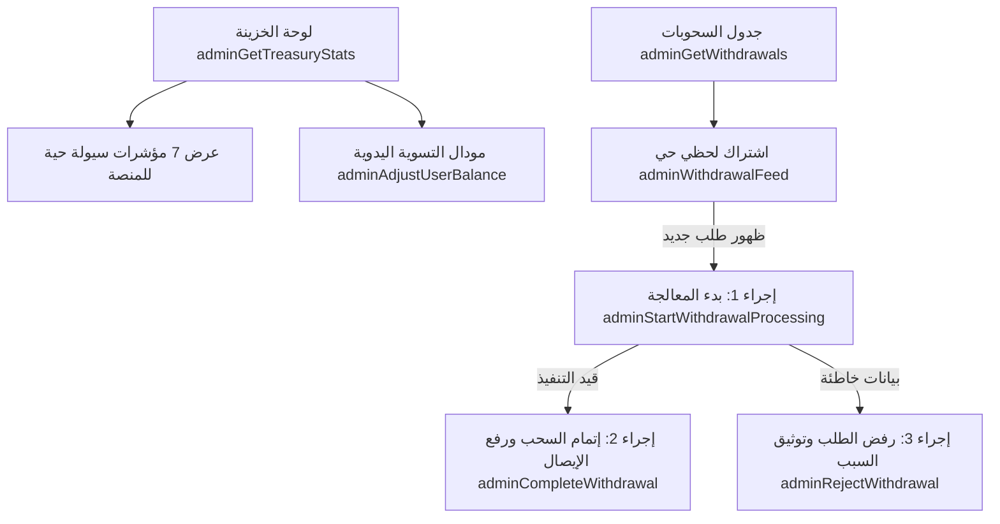

# 📑 دليل المطور للفرونت إند: نظام السحوبات والإدارة المالية (Withdrawals & Treasury System)
### مرجع هندسي شامل لتكامل الفرونت إند (Web & Mobile Apps & Admin Dashboard)

---

## 🌟 1. مقدمة: التحول المعماري الجذري في نظام السحب (The Paradigm Shift)

> [!IMPORTANT]
> **تنبيه حاسم لمطوري الفرونت إند:**
> ❌ **لا تستخدم إطلاقاً الـ Mutation القديمة `withdraw(input: { amount })` التابعة للـ Wallet!**
> هذه العملية كانت مجرد Hook تجريبي داخلي يخصم الفلوس لحظياً بدون وجهات سحب ولا موافقات مالية.
> 
> ✅ **النظام الحقيقي المعتمد هو موديول السحوبات المستقل (`WithdrawalsModule`) عبر `requestWithdrawal`**.

### ما هو الفرق الجوهري؟
1. **نظام الحجز المالي المؤقت (Two-Phase Hold & Capture):**
   عندما يطلب المستخدم سحب 1,000 ج.م، **لا تُخصم فوراً من رصيده الكلي (`balance`)**، بل تُنقل إلى **الرصيد المحجوز (`heldBalance`)**.
   - **الرصيد الكلي (`balance`):** يظل كما هو حتى إتمام التحويل الفعلي.
   - **الرصيد المتاح للتصرف والمزايدة (`availableBalance`):** يقل فوراً بـ 1,000 ج.م لمنع السحب المزدوج أو استخدام الأموال في المزادات.
   - إذا قام المشرف بإتمام التحويل البنكي ⬅️ يتم خصم الرصيد نهائياً (`capture`).
   - إذا ألغى المستخدم الطلب أو رفضه الأدمن ⬅️ يُفك الحجز ويعود الرصيد متاحاً فوراً (`release`).

2. **قنوات تحويل متعددة وبوابات محلية (Multi-Payout Channels):**
   دعم التحويل للحسابات البنكية (Bank Transfer)، شبكة المدفوعات اللحظية (InstaPay)، والمحافظ الإلكترونية (Vodafone Cash, Orange, Etisalat, WE).

3. **دورة حياة وحالات دقيقة (Finite State Machine):**
   `PENDING` ⬅️ `PROCESSING` ⬅️ `COMPLETED` أو `REJECTED` أو `CANCELLED`.

4. **توقيت القاهرة والحد اليومي المحكم (`Africa/Cairo` Daily Limit):**
   مسموح لكل مستخدم بطلب سحب **نشط أو مكتمل واحد فقط في اليوم التقويمي** (يحسب بتوقيت مصر `Africa/Cairo` عبر كود الداتابيز ومفهرس جزئياً لمنع أي تلاعب أو Race Conditions).

---

## 📱 2. تسلسل الشاشات وتدفق تجربة المستخدم (User Experience & Page Sequence)

### أ) تطبيق المستخدم (Mobile App / Web App)



#### 1. شاشة المحفظة الرئيسية (`WalletOverviewScreen`)
- **ماذا يعرض الفرونت؟**
  - **الرصيد الكلي (`balance`):** إجمالي أموال المستخدم في حسابه.
  - **الرصيد المحجوز (`heldBalance`):** مجموع الأموال المحجوزة في مزادات نشطة أو سحوبات معلقة.
  - **الرصيد المتاح (`availableBalance`):** وهو `balance - heldBalance` (هذا هو المبلغ الوحيد المسموح للمستخدم بسحبه أو المزايدة به).
- **العنصر التفاعلي:** زر أساسي واضح: **"طلب سحب رصيد" (Withdraw Funds)**.

#### 2. شاشة / نافذة طلب السحب (`RequestWithdrawalModal` / `Page`)
- **الخطوة الأولى — المبلغ:**
  - حقل إدخال المبلغ (مع عرض الرصيد المتاح كرقم استرشادي، وزر "الحد الأقصى").
  - **قيد الفرونت:** الحد الأدنى 50 ج.م، ولا يتجاوز `availableBalance`.
- **الخطوة الثانية — اختيار وسيلة الاستلام (`payoutMethod`):**
  - راديو / كروت اختيار:
    1. حساب بنكي (`BANK_ACCOUNT`) — حتى 10,000,000 ج.م.
    2. انستاباي (`INSTAPAY`) — حتى 50,000 ج.م.
    3. فودافون كاش (`VODAFONE_CASH`) — حتى 50,000 ج.م.
    4. أورنج كاش (`ORANGE_CASH`) — حتى 50,000 ج.م.
    5. اتصالات كاش (`ETISALAT_CASH`) — حتى 50,000 ج.م.
    6. وي باي (`WE_PAY`) — حتى 50,000 ج.م.
- **الخطوة الثالثة — استعراض الحسبة المباشرة (`withdrawalFeePreview` Query):**
  - بمجرد إدخال المبلغ واختيار الوسيلة، يتم استدعاء الاستعلام وإظهار كارت شفاف أنيق:
    - **نسبة العمولة:** `2%`
    - **قيمة العمولة (`fee`):** مثال: `20.00 EGP`
    - **المبلغ الصافي المستلم (`netAmount`):** مثال: `980.00 EGP`
    - **الوقت المتوقع لوصول التحويل (`estimatedDelivery`):**
      - للحساب البنكي: `"3-5 business days"` (3-5 أيام عمل).
      - لانستاباي والمحافظ: `"Within 24 business hours"` (خلال 24 ساعة عمل).
- **الخطوة الرابعة — بيانات المستلم الديناميكية (`payoutDetails`):**
  - تتغير الحقول حسب الوسيلة المختارة:
    - إذا اختار **`BANK_ACCOUNT`**:
      - اسم البنك (`bankName`) — إلزامي.
      - اسم صاحب الحساب ثلاثي/رباعي (`accountHolderName`) — إلزامي.
      - رقم الحساب أو الـ IBAN (`accountNumber` أو `iban`) — أحدهما إلزامي على الأقل.
    - إذا اختار **`INSTAPAY`**:
      - عنوان الدفع اللحظي (`ipaAddress`) مثل `name@instapay` أو رقم الهاتف المسجل في انستاباي (`phoneNumber`) — أحدهما إلزامي.
    - إذا اختار **محفظة إلكترونية** (`VODAFONE_CASH`, `ORANGE_CASH`, ...):
      - رقم الهاتف المسجل بالمحفظة (`phoneNumber`) — إلزامي (11 رقماً).
- **الخطوة الخامسة — تأكيد الإرسال (`requestWithdrawal` Mutation):**
  - إظهار مؤشر تحميل (Loading Spinner)، وتأكيد الخصم المبدئي وتحويل المستخدم لشاشة متابعة الطلبات.

#### 3. شاشة سجل وتفاصيل السحوبات (`MyWithdrawalsScreen`)
- **قائمة الطلبات (`myWithdrawals` Query):**
  - عرض كروت الطلبات مرتبة تنازلياً مع إمكانية الفلترة حسب الحالة (`status`) والوسيلة (`payoutMethod`).
- **حالات الطلب والشارات (Badges):**
  | الحالة | اللون المقترح | النص العربي | السلوك المتاح للمستخدم |
  |:---|:---:|:---|:---|
  | `PENDING` | 🟡 أصفر / برتقالي | قيد المراجعة | **زر "إلغاء الطلب" مفعل** |
  | `PROCESSING` | 🔵 أزرق | قيد التحويل البنكي | لا يمكن الإلغاء (دخل في مرحلة الإرسال المالي) |
  | `COMPLETED` | 🟢 أخضر | تم التحويل بنجاح | يظهر زر "عرض إيصال التحويل" (`receiptUrl`) ورقم المرجع |
  | `REJECTED` | 🔴 أحمر | تم الرفض | يظهر صندوق يوضح سبب الرفض (`rejectionReason`) |
  | `CANCELLED` | ⚪ رمادي | ملغي بواسطة المستخدم | تم إلغاؤه وفك حجز الأموال |
- **إلغاء الطلب المعلق (`cancelWithdrawal` Mutation):**
  - زر يظهر فقط إذا كانت الحالة `PENDING`.
  - عند الضغط عليه، تظهر رسالة تأكيد، وبمجرد الإلغاء يتحول الـ Badge فوراً لـ `CANCELLED` ويتم فك حجز المبلغ فورياً ليعود متاحاً في المحفظة.

---

### ب) لوحة تحكم الإدارة المالية (Financial Admin Dashboard)



#### 1. لوحة الخزينة الشاملة (`TreasuryDashboardPage`)
- استعلام `adminGetTreasuryStats` لعرض 7 بطاقات إحصائية ضخمة:
  1. إجمالي أرصدة محافظ المستخدمين (`totalWalletBalance`).
  2. إجمالي المبالغ المحتجزة بالمحافظ (`totalHeldInWallets`).
  3. إجمالي مبالغ طلبات السحب المعلقة (`totalPendingWithdrawals`).
  4. عدد طلبات السحب المعلقة (`pendingWithdrawalsCount`).
  5. إجمالي أموال الوساطة المعلقة (`totalHeldInEscrow`).
  6. إجمالي المبالغ المسحوبة المنفذة بنجاح (`totalCompletedPayouts`).
  7. إجمالي أرباح وعمولات المنصة المجمعة من السحوبات (`totalCollectedFees`).
- **زر "تسوية / تعديل رصيد مستخدم" (`adminAdjustUserBalance`):**
  - اختيار المستخدم بـ `userId`.
  - تحديد نوع العملية: إضافة رصيد (`CREDIT`) أو خصم رصيد (`DEBIT`).
  - تحديد المبلغ (`amount`).
  - إدخال سبب التعديل (`reason`) — إلزامي بحد أدنى 10 أحرف لأغراض الرقابة المالية والحوكمة.

#### 2. جدول إدارة السحوبات (`AdminWithdrawalsPage`)
- **التحديث المباشر التلقائي (`adminWithdrawalFeed` Subscription):**
  - أي طلب جديد يتم تقديمه ينزل مباشرة في أعلى الجدول باللون الأخضر الوامض دون حاجة لتحديث المتصفح.
- **إجراءات المشرف على كل طلب:**
  1. **زر "بدء المعالجة" (`adminStartWithdrawalProcessing`):**
     - ينقل الحالة إلى `PROCESSING` ويسجل هوية الأدمن لمنع قيام مشرفين اثنين بالتحويل لنفس الطلب في نفس الوقت.
  2. **زر "إتمام التحويل" (`adminCompleteWithdrawal`):**
     - يفتح مودال يطلب:
       - رقم مرجع التحويل البنكي أو الحوالة (`adminReference`) مثل `CIB-TRX-987654`.
       - رابط الإيصال (`receiptUrl`) المرفوع مسبقاً عبر خدمة الـ Upload.
     - عند التأكيد: تخصم الفلوس نهائياً ويتم إرسال إشعار لحظي وإيميل للمستخدم مع رابط الإيصال.
  3. **زر "رفض الطلب" (`adminRejectWithdrawal`):**
     - يفتح مودال يطلب سبب الرفض (`rejectionReason`) مثل: "رقم الحساب غير صحيح" أو "المحفظة لا تستقبل أموالاً".
     - عند التأكيد: تعود الأموال المحجوزة لمحفظة العميل فوراً ويتم إخطاره بسبب الرفض.

---

## ⚡ 3. مواصفات الـ GraphQL Endpoints الكاملة (API Specification)

> [!NOTE]
> جميع مبالغ الفلوس والعمولات (`amount`, `fee`, `netAmount`, `balance`, `heldBalance`) تُرجع كـ **`String`** لحماية دقة الكسور العشرية. استخدم دائماً `Number(val)` أو `parseFloat(val)` في الفرونت قبل إجراء أي عمليات حسابية أو استدعاء `.toFixed()`.

---

### أ) استعلامات ومعاملات المستخدم (User Endpoints)

#### 1. استعراض وحساب العمولة مسبقاً (`withdrawalFeePreview`)
- **النوع:** `Query`
- **الصلاحية:** متاحة بدون تسجيل أو للمسجلين.
```graphql
query GetFeePreview($amount: Float!, $payoutMethod: PayoutMethod!) {
  withdrawalFeePreview(amount: $amount, payoutMethod: $payoutMethod) {
    requestedAmount    # "1000.00"
    fee                # "20.00"
    feePercentage      # 2
    netAmount          # "980.00"
    maxAllowed         # 50000 أو 10000000
    estimatedDelivery  # "Within 24 business hours" أو "3-5 business days"
  }
}
```
**Variables:**
```json
{
  "amount": 1000,
  "payoutMethod": "INSTAPAY"
}
```

---

#### 2. إنشاء طلب سحب جديد (`requestWithdrawal`)
- **النوع:** `Mutation`
- **الصلاحية:** محمي (`Authorization: Bearer <accessToken>`).
```graphql
mutation RequestWithdrawal($input: RequestWithdrawalInput!) {
  requestWithdrawal(input: $input) {
    _id
    userId
    amount             # "5000.00"
    fee                # "100.00"
    feePercentage      # 2
    netAmount          # "4900.00"
    currency           # "EGP"
    payoutMethod       # "INSTAPAY"
    status             # "PENDING"
    payoutDetails {
      bankName
      accountHolderName
      accountNumber
      iban
      phoneNumber
      ipaAddress       # تنبيه: اسم الحقل ipaAddress
    }
    createdAt
  }
}
```
**Variables (مثال انستاباي):**
```json
{
  "input": {
    "amount": 5000,
    "payoutMethod": "INSTAPAY",
    "payoutDetails": {
      "accountHolderName": "أدهم محمد",
      "phoneNumber": "01012345678",
      "ipaAddress": "adham@instapay"
    }
  }
}
```
**Variables (مثال حساب بنكي):**
```json
{
  "input": {
    "amount": 100000,
    "payoutMethod": "BANK_ACCOUNT",
    "payoutDetails": {
      "bankName": "Commercial International Bank (CIB)",
      "accountHolderName": "Adham Mohamed",
      "accountNumber": "100023456789",
      "iban": "EG3800100001000234567890123"
    }
  }
}
```

---

#### 3. إلغاء طلب سحب معلق (`cancelWithdrawal`)
- **النوع:** `Mutation`
- **الصلاحية:** محمي (`Authorization: Bearer <accessToken>`).
```graphql
mutation CancelWithdrawal($id: ID!) {
  cancelWithdrawal(id: $id) {
    _id
    status             # "CANCELLED"
    updatedAt
  }
}
```
**Variables:**
```json
{
  "id": "673abc123456def789"
}
```

---

#### 4. عرض طلباتي مع الفلترة والصفحات (`myWithdrawals`)
- **النوع:** `Query`
- **الصلاحية:** محمي (`Authorization: Bearer <accessToken>`).
```graphql
query GetMyWithdrawals($pagination: PaginationInput!, $filter: WithdrawalsFilterInput) {
  myWithdrawals(pagination: $pagination, filter: $filter) {
    items {
      _id
      amount
      fee
      netAmount
      currency
      payoutMethod
      status
      rejectionReason
      receiptUrl
      adminReference
      createdAt
      completedAt
    }
    total
    totalPages
    hasNextPage
  }
}
```
**Variables:**
```json
{
  "pagination": {
    "page": 1,
    "limit": 10
  },
  "filter": {
    "status": "PENDING",
    "sortOrder": "DESC"
  }
}
```

---

#### 5. عرض تفاصيل طلب سحب محدد (`myWithdrawal`)
- **النوع:** `Query`
- **الصلاحية:** محمي.
```graphql
query GetMyWithdrawalDetails($id: ID!) {
  myWithdrawal(id: $id) {
    _id
    amount
    fee
    netAmount
    payoutMethod
    payoutDetails {
      bankName
      accountHolderName
      accountNumber
      iban
      phoneNumber
      ipaAddress
    }
    status
    rejectionReason
    receiptUrl
    adminReference
    createdAt
    processedAt
    completedAt
  }
}
```

---

#### 6. الاشتراك اللحظي لتحديثات طلباتي (`myWithdrawalUpdated`)
- **النوع:** `Subscription` (WebSocket: `ws://localhost:3000/graphql`)
- **الصلاحية:** محمي (يرسل الـ Token في `connectionParams: { Authorization: "Bearer <token>" }`).
```graphql
subscription OnMyWithdrawalUpdated {
  myWithdrawalUpdated {
    _id
    status             # تتغير إلى PROCESSING, COMPLETED, REJECTED, CANCELLED
    rejectionReason    # في حال الرفض
    receiptUrl         # في حال الإتمام
    adminReference     # رقم مرجع الحوالة
    completedAt
  }
}
```

---

### ب) استعلامات ومعاملات الأدمن المالي (Admin Endpoints)

> [!NOTE]
> تتطلب جميع هذه العمليات توكن لمستخدم يمتلك الصلاحية: `role: ADMIN`.

#### 1. استعراض كافة السحوبات في النظام (`adminGetWithdrawals`)
```graphql
query AdminGetWithdrawals($pagination: PaginationInput!, $filter: WithdrawalsFilterInput) {
  adminGetWithdrawals(pagination: $pagination, filter: $filter) {
    items {
      _id
      userId
      amount
      fee
      netAmount
      payoutMethod
      status
      payoutDetails {
        bankName
        accountHolderName
        accountNumber
        iban
        phoneNumber
        ipaAddress
      }
      createdAt
    }
    total
    totalPages
    hasNextPage
  }
}
```

---

#### 2. بدء معالجة الطلب وقفله للأدمن (`adminStartWithdrawalProcessing`)
```graphql
mutation AdminStartProcessing($requestId: ID!) {
  adminStartWithdrawalProcessing(requestId: $requestId) {
    _id
    status             # "PROCESSING"
    processedBy
    processedAt
  }
}
```

---

#### 3. إتمام السحب وإرفاق بيانات التحويل والإيصال (`adminCompleteWithdrawal`)
```graphql
mutation AdminCompleteWithdrawal($input: AdminCompleteWithdrawalInput!) {
  adminCompleteWithdrawal(input: $input) {
    _id
    status                      # "COMPLETED"
    adminReference
    receiptUrl
    completionTransactionId     # ربط مع قيد الـ Ledger
    completedAt
  }
}
```
**Variables:**
```json
{
  "input": {
    "withdrawalId": "673abc123456def789",
    "adminReference": "CIB-TRX-987654321",
    "receiptUrl": "https://storage.mazadak.com/receipts/rec_98765.pdf"
  }
}
```

---

#### 4. رفض طلب السحب وإعادة الأموال للمحفظة (`adminRejectWithdrawal`)
```graphql
mutation AdminRejectWithdrawal($input: AdminRejectWithdrawalInput!) {
  adminRejectWithdrawal(input: $input) {
    _id
    status             # "REJECTED"
    rejectionReason
  }
}
```
**Variables:**
```json
{
  "input": {
    "withdrawalId": "673abc123456def789",
    "rejectionReason": "رقم الحساب البنكي غير صحيح ومرفوض من غرفة المقاصة"
  }
}
```

---

#### 5. تقرير الخزينة والسيولة الشامل (`adminGetTreasuryStats`)
```graphql
query AdminGetTreasuryStats {
  adminGetTreasuryStats {
    totalWalletBalance         # إجمالي أرصدة المستخدمين في المنصة
    totalHeldInWallets         # إجمالي الأموال المعلقة داخل المحافظ (مزادات + سحوبات)
    totalPendingWithdrawals    # إجمالي مبالغ السحوبات المعلقة
    pendingWithdrawalsCount    # عدد طلبات السحب المعلقة
    totalHeldInEscrow          # إجمالي المبالغ المحتجزة في الوساطة (Escrow)
    totalCompletedPayouts      # إجمالي المبالغ المسحوبة المنفذة بنجاح
    totalCollectedFees         # إجمالي العمولات التي جنتها المنصة من السحوبات
  }
}
```

---

#### 6. تعديل رصيد مستخدم يدوياً (`adminAdjustUserBalance`)
```graphql
mutation AdminAdjustUserBalance($input: AdminAdjustBalanceInput!) {
  adminAdjustUserBalance(input: $input) {
    _id
    balance
    heldBalance
    availableBalance
  }
}
```
**Variables:**
```json
{
  "input": {
    "userId": "670abc123456789",
    "amount": 500,
    "type": "CREDIT",          # أو "DEBIT"
    "reason": "تعويض مالي للمستخدم عن تأخر الشحنة رقم 42"
  }
}
```

---

#### 7. البث المباشر لطلبات السحب للإدارة (`adminWithdrawalFeed`)
- **النوع:** `Subscription` (WebSocket)
```graphql
subscription OnAdminWithdrawalFeed {
  adminWithdrawalFeed {
    _id
    userId
    amount
    netAmount
    payoutMethod
    status
    createdAt
  }
}
```

---

## 🚨 4. القاموس الكامل لأكواد الأخطاء وكيف يتعامل معها الفرونت إند

عند حدوث خطأ، يُرجع الباك إند رسالة الخطأ داخل `errors[0].message`. هذه هي القائمة الكاملة مع الرسائل المقترحة للواجهة:

| كود الخطأ (`message`) | سبب الخطأ التقني | الرسالة المقترحة للمستخدم (العربية) | User Message (English) |
|:---|:---|:---|:---|
| `INVALID_PAYOUT_DETAILS` | بيانات وسيلة السحب ناقصة (مثال: لم يدخل رقم الحساب للبنك أو هاتف المحفظة) | "يرجى استكمال جميع بيانات التحويل المطلوبة للوسيلة المختارة." | "Please provide all required payout details for the selected method." |
| `WITHDRAWAL_BELOW_MINIMUM` | المبلغ المطلوب أقل من 50 ج.م | "الحد الأدنى لطلب السحب هو 50 ج.م." | "Minimum withdrawal amount is 50 EGP." |
| `WITHDRAWAL_EXCEEDS_MAX_FOR_...` | المبلغ أكبر من السقف المسموح للوسيلة (50 ألف للمحافظ / 10 مليون للبنك) | "المبلغ المطلوب يتجاوز الحد الأقصى المسموح به لهذه الوسيلة." | "Amount exceeds the maximum limit allowed for this payout method." |
| `INSUFFICIENT_FUNDS` | المبلغ المطلوب أكبر من `availableBalance` | "رصيدك المتاح غير كافٍ لإتمام عملية السحب." | "Insufficient available balance to process this withdrawal." |
| `DAILY_WITHDRAWAL_LIMIT_REACHED` | المستخدم لديه طلب نشط أو مكتمل اليوم بتوقيت القاهرة | "لقد استنفدت حد السحب اليومي. مسموح بطلب سحب واحد فقط يومياً." | "Daily withdrawal limit reached. You can only make one request per calendar day." |
| `WITHDRAWAL_NOT_FOUND` | الطلب غير موجود أو لا ينتمي لهذا المستخدم | "طلب السحب غير موجود." | "Withdrawal request not found." |
| `WITHDRAWAL_NOT_CANCELLABLE` | محاولة إلغاء طلب لم يعد `PENDING` (أصبح قيد التحويل أو مكتملاً) | "لا يمكن إلغاء الطلب لأنه قيد التنفيذ أو تم إتمامه بالفعل." | "Cannot cancel this withdrawal as it is already being processed or completed." |
| `WITHDRAWAL_NOT_PENDING` | محاولة المشرف بدء معالجة طلب تم البدء به أو إنهاؤه | "الطلب قيد المعالجة بواسطة مشرف آخر أو لم يعد معلقاً." | "Request is already being processed or is no longer pending." |
| `WITHDRAWAL_NOT_IN_PROGRESS` | محاولة المشرف إتمام طلب غير موجود بحالة `PROCESSING` أو `PENDING` | "لا يمكن إتمام الطلب إلا بعد بدء معالجته." | "Cannot complete request unless it is in progress." |
| `WITHDRAWAL_NOT_REJECTABLE` | محاولة رفض طلب تم إتمامه مسبقاً | "لا يمكن رفض طلب تم تحويله وإتمامه مسبقاً." | "Completed requests cannot be rejected." |
| `AMOUNT_MUST_BE_POSITIVE` | تمرير قيمة سالبة أو صفر لتعديل الرصيد | "يجب أن يكون المبلغ أكبر من الصفر." | "Adjustment amount must be strictly positive." |
| `REASON_TOO_SHORT` / `REASON_REQUIRED` | سبب التعديل اليدوي للأدمن فارغ أو أقل من 10 أحرف | "سبب التعديل إلزامي ويجب ألا يقل عن 10 أحرف لتوثيق السجل المالي." | "Reason is required and must be at least 10 characters long." |

---

## 💡 5. نصائح ذهبية لمطوري الفرونت إند (Best Practices)

1. **حساب الرصيد المتاح على الشاشة:**
   ```ts
   // معادلة الرصيد المتاح الصحيحة دائماً:
   const available = Number(wallet.balance) - Number(wallet.heldBalance);
   ```
2. **التحقق من صحة الإدخال في الفرونت إند مسبقاً (Client-Side Validation):**
   - رقم هاتف المحفظة وانستاباي يجب أن يبدأ بـ `01` ويتكون من 11 رقماً: `/^01[0125][0-9]{8}$/`.
   - الـ IBAN المصري يتكون من 29 حرفاً ويبدأ بـ `EG`.
3. **التحديث الفوري عند استقبال الاشتراكات (Apollo / Urql Cache Update):**
   - عند استقبال حدث `myWithdrawalUpdated`، قم بتحديث الـ Cache الخاص بالـ Query `myWithdrawals` و `myWithdrawal` تلقائياً لتنعكس الحالة فوراً بدون وميض أو إعادة تحميل.
   - كذلك استمع لـ `walletUpdated` لتحديث أرقام الرصيد والمحجوز فوراً في شريط الهيدر.
4. **تسمية حقل انستاباي:**
   - تأكد أن الحقل في الـ GraphQL Input اسمه **`ipaAddress`** وليس `instapayAddress`.
