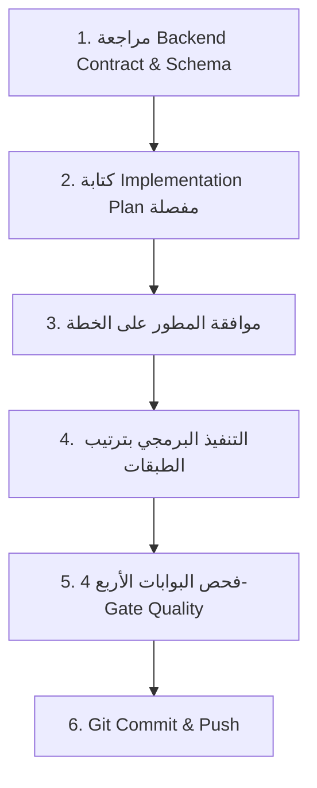

# دليل إعداد خطط التنفيذ والأنماط المعمارية — مشروع مزادك Frontend
## (Mazadak Frontend — Implementation Plan Blueprint & Architecture Guide)

> **الهدف:** هذا الملف هو المرجع المعماري والقاعدي الثاني في مجلد `.agents/`.
> يُقرأ قبل كتابة أي **Implementation Plan** وقبل تنفيذ أي Feature أو Module جديد.
> يضمن الحفاظ على أعلى معايير الـ Best Practices وتوحيد الـ Pattern عبر كافة أجزاء المشروع حتى لو تم توليد الخطة في جلسات مختلفة أو بعد انتهاء الـ Tokens.

---

## 🧭 جدول المحتويات
1. [خريطة تقدم المشروع (Current Progress Status)](#1-خريطة-تقدم-المشروع-current-progress-status)
2. [المبادئ المعمارية غير القابلة للتفاوض (Non-Negotiable Principles)](#2-المبادئ-المعمارية-غير-قابلة-للتفاوض-non-negotiable-principles)
3. [دورة حياة تنفيذ الـ Feature (Feature Execution Lifecycle)](#3-دورة-حياة-تنفيذ-الـ-feature-feature-execution-lifecycle)
4. [هيكل مجلد الـ Feature الموحد (Feature Folder Structure)](#4-هيكل-مجلد-الـ-feature-الموحد-feature-folder-structure)
5. [القالب المعياري لكتابة Implementation Plan بالتفصيل](#5-القالب-المعياري-لكتابة-implementation-plan-بالتفصيل)
6. [قواعد الترجمة وثنائية اللغة (i18n & RTL/LTR)](#6-قواعد-الترجمة-وثنائية-اللغة-i18n--rtlltr)
7. [أنماط الـ State Management و TanStack Query v5](#7-أنماط-الـ-state-management-و-tanstack-query-v5)
8. [فحص الجودة الإلزامي (The 4-Gate Quality Verification)](#8-فحص-الجودة-الإلزامي-the-4-gate-quality-verification)

---

## 1. خريطة تقدم المشروع (Current Progress Status)

| الأولوية | الموديول | الـ Branch | الحالة | قسم الـ Contract |
|:---:|:---|:---|:---:|:---|
| 1️⃣ | **Foundation** (Setup + AppShell + Routing + Theme + i18n) | `feature/foundation-setup` | ✅ **مكتمل 100%** | — |
| 2️⃣ | **Auth Module** (Login, Register, Google Auth, Verify, Reset, Reactivate) | `feature/auth-module` | ✅ **مكتمل 100%** | القسم 1 |
| 3️⃣ | **Auctions Module** (Browse, Detail, Create Wizard, Edit, My Auctions) | `feature/auctions-module` | 🚀 **المرحلة القادمة** | القسم 3 |
| 4️⃣ | **Bids Module** (Live Bidding Box, Auto-bid Modal, My Bids) | `feature/bids-module` | ⏳ قيد الانتظار | القسم 4 |
| 5️⃣ | **Wallet Module** (Balance, Deposit REST, Withdraw, Transactions) | `feature/wallet-module` | ⏳ قيد الانتظار | القسم 5 + 6 |
| 6️⃣ | **Escrow Module** (Escrow Details, Disputes, My Escrows) | `feature/escrow-module` | ⏳ قيد الانتظار | القسم 7 |
| 7️⃣ | **Chat Module** (Auction Chat Drawer, Direct Messages Inbox) | `feature/chat-module` | ⏳ قيد الانتظار | القسم 9 + 11.4 |
| 8️⃣ | **Notifications Module** (Dropdown + Notification Center) | `feature/notifications-module` | ⏳ قيد الانتظار | القسم 8 + 11.1 |
| 9️⃣ | **Reviews Module** (Write Review, Reply, Rating Breakdown) | `feature/reviews-module` | ⏳ قيد الانتظار | القسم 10 |
| 🔟 | **Users Module** (Profile Settings, Public User Page) | `feature/users-module` | ⏳ قيد الانتظار | القسم 2 |
| 1️⃣1️⃣ | **Admin Module** (Dashboard, Users, Auctions, Disputes, Financials) | `feature/admin-module` | ⏳ قيد الانتظار | القسم 12 |

---

## 2. المبادئ المعمارية غير القابلة للتفاوض (Non-Negotiable Principles)

### 📌 2.1 القاعدة الذهبية لفصل المسؤوليات (Single Responsibility Principle)
```
┌─────────────────────────────────────────────────────────────┐
│ 1. Component (.tsx)                                         │
│    ← يرسم واجهة المستخدم فقط (Pure UI Presentation)        │
│    ← لا يعرف أي شيء عن Axios أو GraphQL أو Endpoints        │
│    ← يستقبل البيانات والـ Callbacks من الـ Hook فقط         │
├─────────────────────────────────────────────────────────────┤
│ 2. Custom Hook (.ts)                                        │
│    ← يدير منطق الـ Feature وحالات الـ Loading/Error/Success │
│    ← يستدعي دوال الـ Service المناسبة                       │
│    ← يتعامل مع TanStack Query (Queries & Mutations)         │
├─────────────────────────────────────────────────────────────┤
│ 3. Service (.service.ts)                                    │
│    ← يحتوي على استعلامات الـ GraphQL (Queries / Mutations)   │
│    ← يتحدث مع الباك إند عبر apiClient / executeGraphQL      │
│    ← مسؤول عن Data Normalization وتمرير الـ Errors          │
└─────────────────────────────────────────────────────────────┘
```

### 📌 2.2 الصرامة البرمجية في TypeScript
- ❌ **ممنوع منعاً باتاً استخدام `any`** في أي سطر كود جديد.
- ✅ استخدام `unknown` مع Type Guards أو Zod Parsers عند استلام أخطاء أو بيانات غير مؤكدة.
- ✅ مطابقة كل الـ Types والـ Enums بدقة مع ملف `schema.gql`.

### 📌 2.3 الإلزامية الثنائية للغات (Bilingual Mandatory Requirement)
- ❌ ممنوع كتابة نصوص ثابتة (Hardcoded Strings) في أي Component (عربي أو إنجليزي).
- ✅ كل نص يجب أن يُقرأ عبر `useTranslation('[module]')` أو `useTranslation('common')`.
- ✅ كل Feature جديدة تتطلب إضافة المفاتيح في ملفين بالتوازي:
  - `src/locales/ar/[module].json` (النصوص العربية)
  - `src/locales/en/[module].json` (النصوص الإنجليزية)

---

## 3. دورة حياة تنفيذ الـ Feature (Feature Execution Lifecycle)

قبل كتابة أي كود لأي Feature، نتبع المراحل الست التالية بالتسلسل:



### المرحلة 1: مراجعة العقود والـ Schema
- فتح ملف `.agents/BACKEND_CONTRACT.md` وقراءة القسم المخصص للموديول.
- فتح ملف `.agents/schema.gql` ومطابقة أسماء الـ Queries والـ Inputs والـ Enums.

### المرحلة 2: كتابة خطة التنفيذ (Implementation Plan)
- كتابة الخطة بالهيكل المفصل الموضح في [القسم 5](#5-القالب-المعياري-لكتابة-implementation-plan-بالتفصيل).

### المرحلة 3: المراجعة والاعتماد
- عرض الخطة على المطور، واستقبال أي تعديلات معمارية أو UI/UX.

### المرحلة 4: التنفيذ البرمجي بالترتيب الإلزامي للطبقات:
1. **Types & Enums:** (`types/[module].types.ts`)
2. **Zod Validation Schemas:** (`schemas/[feature].schema.ts`)
3. **API Service:** (`services/[module].service.ts`)
4. **Custom Hooks:** (`hooks/use[Feature].ts`)
5. **Sub-components:** (`components/[Component].tsx`)
6. **Pages:** (`pages/[PageName]Page.tsx`)
7. **Translations:** (`locales/ar/[module].json` & `locales/en/[module].json`)
8. **Routing & Exports:** (`routes/AppRoutes.tsx` & `index.ts`)

### المرحلة 5: فحص البوابات الأربع (The 4-Gate Check)
1. `npm run lint` → 0 errors.
2. `npx tsc --noEmit` → 0 errors.
3. `npm run build` → Build successful.
4. فتح المتصفح والـ Console للتأكد من انعدام أخطاء الـ Runtime.

### المرحلة 6: الـ Commit
- استخدام رسالة Commit توضح العمل بدقة طبقاً لقواعد الـ Git.

---

## 4. هيكل مجلد الـ Feature الموحد (Feature Folder Structure)

كل موديول جديد يجب أن يتبع هذا التقسيم الداخلي بالكامل بدون أي شذوذ:

```
src/features/[module-name]/
├── components/                 # مكونات الـ UI الخاصة بالموديول فقط
│   ├── [ComponentName].tsx
│   └── ...
├── hooks/                      # الـ Custom Hooks (State & React Query logic)
│   ├── use[FeatureName].ts
│   └── ...
├── pages/                      # صفحات كاملة تُربط في الـ Router
│   ├── [FeatureName]Page.tsx
│   └── ...
├── schemas/                    # Zod Schemas للتحقق من صحة المدخلات
│   ├── [feature].schema.ts
│   └── ...
├── services/                   # استعلامات الـ GraphQL والاتصال بالـ API
│   └── [module].service.ts
├── types/                      # تعريفات الـ TypeScript والـ Enums
│   └── [module].types.ts
└── index.ts                    # Barrel Export لكل ما يُصدر من الموديول
```

---

## 5. القالب المعياري لكتابة Implementation Plan بالتفصيل

عند إنشاء أي Implementation Plan، يجب أن تتبع هذا الهيكل المنظم، حيث تحتوي كل خطة على التفاصيل الكاملة لتكون دليلاً تقنياً واضحاً ومستقلاً:

---

### [بداية قالب خطة التنفيذ المعتمد]

```markdown
# Implementation Plan — [اسم الموديول / Feature]

**الهدف:** [شرح مختصر في سطرين عن وظيفة الموديول والهدف منه]
**المرجع في الباك إند:** قسم رقم [X] في `.agents/BACKEND_CONTRACT.md` والـ Types في `.agents/schema.gql`.
**الـ Branch:** `feature/[module-name]`

---

## 1. تحليل المتطلبات والـ GraphQL Contracts
- **الاستعلامات (Queries):**
  - `queryName(input: InputType): ResponseType`
- **العمليات (Mutations):**
  - `mutationName(input: InputType): ResponseType`
- **الاشتراكات الحية (Subscriptions) [إن وجدت]:**
  - `subscriptionName(id: ID!): EventPayload`
- **كودات الأخطاء المتوقعة من الباك إند:**
  | كود الخطأ | المعنى | طريقة المعالجة في الفرونت |
  |---|---|---|
  | `ERROR_CODE_1` | ... | عرض تنبيه أحمر للمستخدم |
  | `ERROR_CODE_2` | ... | توجيه المستخدم لصفحة معينة |

---

## 2. هيكل الملفات المزمع إنشاؤها وتعديلها (Proposed File Structure)

### [NEW] الملفات الجديدة:
- `src/features/[module]/types/[module].types.ts`
- `src/features/[module]/schemas/[feature].schema.ts`
- `src/features/[module]/services/[module].service.ts`
- `src/features/[module]/hooks/use[Feature].ts`
- `src/features/[module]/components/[Component].tsx`
- `src/features/[module]/pages/[Page]Page.tsx`
- `src/features/[module]/index.ts`
- `src/locales/ar/[module].json`
- `src/locales/en/[module].json`

### [MODIFY] الملفات القائمة:
- `src/constants/routes.constants.ts` (إضافة المسارات الجديدة)
- `src/routes/AppRoutes.tsx` (ربط الصفحات بالمسارات والـ Guards)

---

## 3. خطة التنفيذ خطوة بخطوة (Step-by-Step Implementation)

### الخطوة 1: الـ Types والـ Enums (`types/[module].types.ts`)
- كتابة الـ Interfaces المطابقة للـ Schema بدقة.
- تعريف الـ Input Types والـ Response Payloads.

### الخطوة 2: مخططات التحقق Zod (`schemas/[feature].schema.ts`)
- بناء الـ Validation Schemas مع رسائل الخطأ المستندة لمفاتيح الترجمة `t('validation....')`.

### الخطوة 3: طبقة الخدمة والـ API (`services/[module].service.ts`)
- كتابة استعلامات الـ GraphQL (Fragments + Operations).
- استخدام `executeGraphQL` الموحدة ومعالجة الأخطاء.

### الخطوة 4: خطافات الـ State وإدارة الخادم (`hooks/use[Feature].ts`)
- ربط دوال الخدمة بـ TanStack Query (`useQuery` / `useMutation`).
- إدارة الـ Query Invalidation وتحديث الـ Cache.
- معالجة أخطاء الـ API عبر `parseAppError` و `getLocalizedErrorMessage`.

### الخطوة 5: بناء مكونات الواجهة (`components/`)
- بناء المكونات التقديمية المجردة.
- الالتزام بنظام التصميم (Tailwind + CSS Tokens).
- دعم حالات: Loading Skeleton, Error Alert, Empty State, Success State.

### الخطوة 6: بناء الصفحات الكاملة (`pages/`)
- تجميع المكونات والـ Hooks في صفحة كاملة.
- توفير SEO Tags و Page Title.

### الخطوة 7: الترجمة والتوطين (i18n)
- إدخال كافة المفاتيح بالعربية في `src/locales/ar/[module].json`.
- إدخال كافة المفاتيح بالإنجليزية في `src/locales/en/[module].json`.

### الخطوة 8: التوجيه والـ Routing
- تعريف المسارات في `routes.constants.ts`.
- تسجيل الـ Routes وتحديد ما إذا كانت عامة (Public) أو خاصة (ProtectedRoute).

---

## 4. خطة التحقق والاختبار (Verification Plan)
- [ ] التحقق من خلو الكود من أخطاء الـ Lint (`npm run lint`).
- [ ] التحقق من سلامة الأنواع الصارمة في TypeScript (`npx tsc --noEmit`).
- [ ] اختبار بناء المشروع للإنتاج (`npm run build`).
- [ ] تجربة كل سيناريو في المتصفح (حالة النجاح، حالة الخطأ، حالة ضعف الاتصال، حالة البيانات الفارغة).
- [ ] التحقق من التبديل بين اللغتين (العربية RTL والإنجليزية LTR).
- [ ] التحقق من التبديل بين الـ Dark / Light mode.
```

### [نهاية قالب خطة التنفيذ المعتمد]

---

## 6. قواعد الترجمة وثنائية اللغة (i18n & RTL/LTR)

1. **تقسيم ملفات الترجمة حسب الموديول:**
   - ملفات الموديول: `src/locales/{ar,en}/[module].json`
   - ملفات النصوص العامة: `src/locales/{ar,en}/common.json`
   - ملفات المصادقة: `src/locales/{ar,en}/auth.json`

2. **هيكل مفاتيح الترجمة الموحد داخل كل ملف:**
   ```json
   {
     "pageTitle": "...",
     "sections": {
       "header": "...",
       "details": "..."
     },
     "form": {
       "labels": { ... },
       "placeholders": { ... },
       "buttons": { ... }
     },
     "validation": {
       "required": "...",
       "invalid": "..."
     },
     "errors": {
       "SPECIFIC_BACKEND_ERROR_CODE": "..."
     },
     "messages": {
       "success": "..."
     }
   }
   ```

3. **التعامل مع الاتجاهات (Direction & Icons):**
   - استخدام Logical Utilities في Tailwind (مثل `start-`, `end-`, `ms-`, `me-`, `ps-`, `pe-`).
   - في الأسهم أو الأيقونات الاتجاهية: عكس الأيقونة في وضع الـ RTL أو استخدام `isRTL ? <ArrowLeft /> : <ArrowRight />`.

---

## 7. أنماط الـ State Management و TanStack Query v5

### 📌 7.1 هيكل الـ Query Keys الموحد (Query Key Factory Pattern)
يمنع التضارب ويسهل عملية الـ Invalidation:

```ts
export const AUCTION_QUERY_KEYS = {
  all: ['auctions'] as const,
  lists: () => [...AUCTION_QUERY_KEYS.all, 'list'] as const,
  list: (filters: AuctionFilterInput) => [...AUCTION_QUERY_KEYS.lists(), filters] as const,
  details: () => [...AUCTION_QUERY_KEYS.all, 'detail'] as const,
  detail: (id: string) => [...AUCTION_QUERY_KEYS.details(), id] as const,
  myAuctions: (status?: string) => [...AUCTION_QUERY_KEYS.all, 'my-auctions', status] as const,
};
```

### 📌 7.2 إبطال الـ Cache عند التعديل (Mutation Invalidation)
```ts
const queryClient = useQueryClient();

const mutation = useMutation({
  mutationFn: auctionService.createAuction,
  onSuccess: () => {
    // إبطال قوائم المزادات لتحديث البيانات تلقائياً
    queryClient.invalidateQueries({ queryKey: AUCTION_QUERY_KEYS.lists() });
  },
});
```

### 📌 7.3 تنظيف الـ WebSocket Subscriptions (Mandatory Cleanup)
```ts
useEffect(() => {
  if (!auctionId) return;

  const unsubscribe = socketService.subscribeToAuction(auctionId, (newBid) => {
    // تحديث البيانات أو إبطال الـ Query
  });

  return () => {
    unsubscribe(); // ← إلزامي لمنع تسريب الذاكرة (Memory Leak)
  };
}, [auctionId]);
```

---

## 8. فحص الجودة الإلزامي (The 4-Gate Quality Verification)

بعد الانتهاء من كتابة وتجميع أي Feature، وقبل طلب اعتمادها أو عمل Commit، يجب تشغيل الفحوصات التالية تباعاً:

```bash
# البوابة 1: التدقيق اللغوي والبرمجي
npm run lint

# البوابة 2: فحص الأنواع الصارم
npx tsc --noEmit

# البوابة 3: فحص بناء الـ Bundle للإنتاج
npm run build
```

**البوابة 4 (فحص المتصفح الحي):**
- فتح DevTools Console والتأكد من انعدام أخطاء JavaScript الحمراء أو تحذيرات React غير المعالجة.
- فتح Network Tab والتأكد من نجاح الـ GraphQL Queries وصحة الـ Status Codes.
- اختبار الاستجابة على الشاشات المختلفة (Desktop / Tablet / Mobile).
- اختبار التبديل السلس بين اللغتين (العربية والإنجليزية) وتوافق الـ RTL.

---

> **خلاصة:** عند بدء أي Feature جديدة، اطلب من المساعد قراءة هذا الملف وملف `BACKEND_CONTRACT.md` لتوليد الـ Implementation Plan بأعلى مستوى من الاحترافية والاتساق المعماري.
